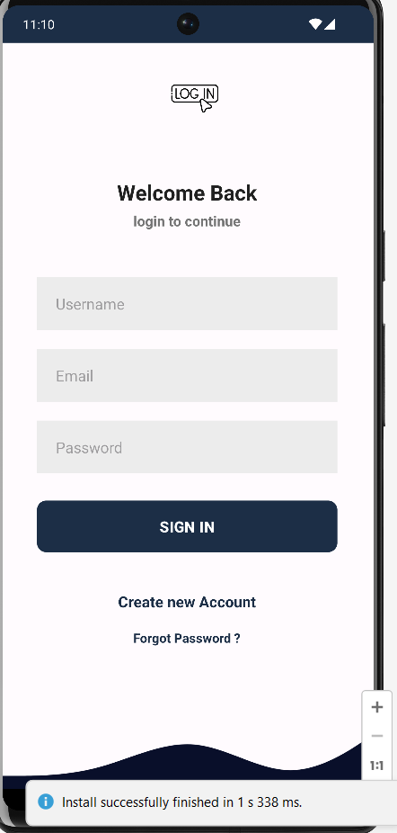
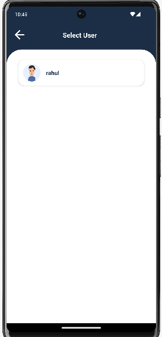
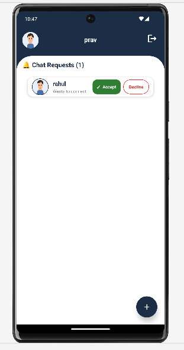
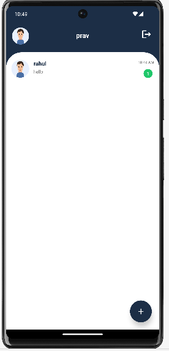
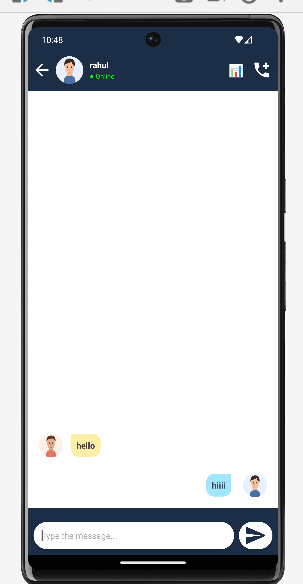
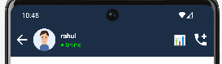
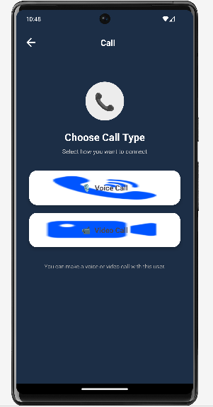
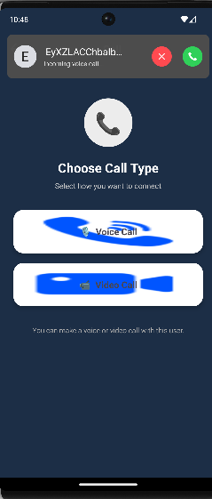
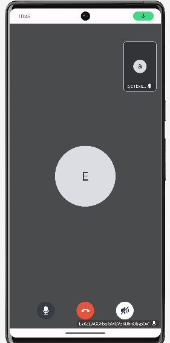
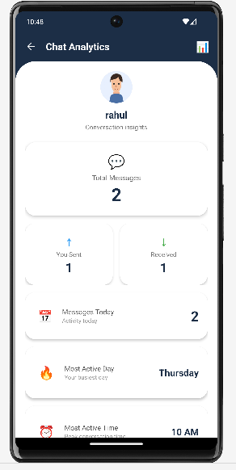

# 💬 Prime - Real-Time Chatting Application

A modern Android chatting application built with **Java, Firebase Realtime Database, Firebase Authentication, Firebase Storage, and ZEGOCLOUD**.

Prime allows users to create accounts, discover other users, send and accept chat requests, communicate in real time, view online/offline status, and make voice/video calls.

---

## 📱 Screenshots

### 🔐 Authentication & User Selection

| Sign In | Select User |
|--------|---------|
|  |  |

---

### 💬 Chat Requests & Chat List

| Chat Request | Chat List |
|-------------|--------------|
|  |  |

---

### 💬 Chat Window & Online Status

| Chat Window | Online Status |
|-----------|-------------|
|  |  |

---

### 📞 Voice & Video Calling

| Call Selection | Voice Call |
|----------------|------------|
|  |  |

---

### 🎥 Video Call & Chat Analytics

| Video Call | Chat Analytics |
|----------------|------------|
|  |  |

---

## ✨ Features

### 🔐 Authentication

- User registration
- User login
- Firebase Authentication
- Forgot password
- Persistent login session
- Logout functionality
- Input validation

### 👤 User Management

- Display registered users
- User profile
- Default profile image
- User selection screen
- Firebase UID based user identification

### 🤝 Chat Requests

- Send chat request
- Receive chat request
- Accept request
- Decline request
- Prevent duplicate requests
- Detect already pending requests
- Automatically create chat connection after acceptance

### 💬 Real-Time Messaging

- One-to-one messaging
- Real-time Firebase messages
- Sender and receiver message layouts
- Last message preview
- Message timestamp
- Unread message count
- Chat list

### 🟢 Online Status

- Online/offline indicator
- Last seen timestamp
- Firebase connection monitoring
- Automatic offline status when connection is lost

### 📞 Voice & Video Calls

- Voice calling
- Video calling
- ZEGOCLOUD call invitations
- Incoming call support
- Call invitation interface

### 📊 Chat Analytics

- Chat analytics screen
- Message statistics
- Conversation information

---

## 🛠️ Technologies Used

| Technology | Purpose |
|------------|---------|
| Java | Application development |
| Android Studio | Development environment |
| XML | UI design |
| Firebase Authentication | User authentication |
| Firebase Realtime Database | Real-time data and messaging |
| Firebase Storage | File/profile storage |
| ZEGOCLOUD | Voice and video calling |
| RecyclerView | User and message lists |
| Material Components | UI components |
| Picasso | Image loading |
| ConstraintLayout | UI layouts |
| CardView | UI cards |

---

## 🏗️ Application Architecture

The application follows a Firebase-based architecture.

```text
                    ┌─────────────────────┐
                    │      Android App    │
                    │     Prime Chat      │
                    └──────────┬──────────┘
                               │
              ┌────────────────┼────────────────┐
              │                │                │
              ▼                ▼                ▼
      ┌──────────────┐ ┌──────────────┐ ┌──────────────┐
      │   Firebase   │ │   Firebase   │ │  ZEGOCLOUD   │
      │ Authentication│ │  Realtime DB │ │ Voice/Video  │
      └──────────────┘ └──────────────┘ └──────────────┘
              │                │                │
              ▼                ▼                ▼
          Login/User       Messages/Users     Calls
          Accounts        Requests/Status
```

---

## 🔥 Firebase Database Structure

The application uses Firebase Realtime Database.

**Users**
```text
Users
│
├── USER_ID_1
│   ├── username
│   ├── email
│   ├── profileImage
│   ├── userId
│   ├── online
│   └── lastSeen
│
└── USER_ID_2
    ├── username
    ├── email
    ├── profileImage
    ├── userId
    ├── online
    └── lastSeen
```

**Chat Requests**
```text
chatRequests
│
└── RECEIVER_ID
    │
    └── REQUEST_ID
        ├── senderId
        ├── senderName
        ├── receiverId
        ├── receiverName
        ├── status
        └── timestamp
```

Example:
```json
{
  "senderId": "USER_ID_1",
  "senderName": "Praveen",
  "receiverId": "USER_ID_2",
  "receiverName": "Rahul",
  "status": "pending",
  "timestamp": 1786594518132
}
```

**Messaging Structure**

Messages are stored using the two users' IDs.

```text
Messages
│
└── USER_A_USER_B
    │
    ├── MESSAGE_ID_1
    │   ├── senderId
    │   ├── receiverId
    │   ├── message
    │   └── timestamp
    │
    └── MESSAGE_ID_2
        ├── senderId
        ├── receiverId
        ├── message
        └── timestamp
```

This allows the application to retrieve the conversation between two users in real time.

---

## 📂 Project Structure

```text
Prime/
│
├── app/
│   │
│   └── src/
│       │
│       └── main/
│           │
│           ├── java/
│           │   │
│           │   └── com/example/prime/
│           │       │
│           │       ├── ChatListModel.java
│           │       ├── ChatRequest.java
│           │       ├── UserSelectAdapter.java
│           │       ├── Users.java
│           │       ├── userAdapter.java
│           │       ├── messagesAdapterr.java
│           │       ├── msgModelclass.java
│           │       │
│           │       └── activities/
│           │           │
│           │           ├── SignIn.java
│           │           ├── SignUp.java
│           │           ├── useradd.java
│           │           ├── firstUsersPage.java
│           │           ├── ChatWindow.java
│           │           ├── ChatRequestAdapter.java
│           │           ├── ChatAnalyticsActivity.java
│           │           ├── callingAct.java
│           │           ├── videocall.java
│           │           ├── SplashActivity.java
│           │           ├── forgotPass.java
│           │           └── nameStore.java
│           │
│           └── res/
│               │
│               ├── drawable/
│               │
│               ├── layout/
│               │   ├── activity_sign_in.xml
│               │   ├── activity_sign_up.xml
│               │   ├── activity_useradd.xml
│               │   ├── activity_chat_window.xml
│               │   ├── activity_first_users_page.xml
│               │   ├── activity_videocall.xml
│               │   ├── request_item.xml
│               │   ├── user_item.xml
│               │   ├── sender_layout.xml
│               │   └── receiver_layout.xml
│               │
│               └── values/
│
├── screenshots/
│   ├── login.png.png
│   ├── select-user.png.png
│   ├── chat-request.png.png
│   ├── chat-list.png.png
│   ├── chat-window.png.png
│   ├── status.png.png
│   ├── call-selection.png.png
│   ├── call.png.png
│   ├── video-call.png.png
│   └── user-stats.png.png
│
├── build.gradle
├── settings.gradle
└── README.md
```

---

## 🚀 Getting Started

### 1. Clone the Repository
```bash
git clone YOUR_GITHUB_REPOSITORY_URL
cd Prime
```

### 2. Open the Project
Open the project in Android Studio and wait for Gradle synchronization to finish.

---

## 🔥 Firebase Setup

The application requires Firebase.

**Step 1** — Create a Firebase project.

**Step 2** — Add your Android application to Firebase using your application's package name: `com.example.prime`

**Step 3** — Download `google-services.json` and place it inside `app/google-services.json`

**Step 4** — Enable Firebase Authentication → Email/Password sign-in method.

---

## 🗄️ Firebase Realtime Database

Create a Firebase Realtime Database. The application uses it for:
- Users
- Chat Requests
- Messages
- Online Status
- Last Seen

Make sure your database rules allow authenticated users to access the required data.

> ⚠️ Do not use public Firebase database rules in a production application.

---

## 📞 ZEGOCLOUD Setup

The application uses ZEGOCLOUD for voice and video calls.

Create a ZEGOCLOUD project and obtain an **App ID** and **App Sign**, then configure them in the call initialization code:

```java
long appID = YOUR_APP_ID;
String appSign = "YOUR_APP_SIGN";
```

> ⚠️ Never expose production secrets or App Signs in a public GitHub repository. For a production application, use a secure backend/token system.

---

## ▶️ Running the Application

1. Open the project in Android Studio.
2. Connect an Android device or start an emulator.
3. Make sure Firebase is configured.
4. Make sure ZEGOCLOUD credentials are configured.
5. Click **Run ▶**

The application will start on the connected device.

---

## 🔄 Application Flow

```text
                    ┌─────────────┐
                    │    Splash   │
                    │    Screen   │
                    └──────┬──────┘
                           │
                           ▼
                 ┌──────────────────┐
                 │ Already Logged In│
                 │        ?         │
                 └────────┬─────────┘
                    Yes   │   No
                    ┌─────┘   └──────┐
                    ▼                ▼
              ┌──────────┐     ┌──────────┐
              │ User Home│     │ Sign In  │
              └──────────┘     └────┬─────┘
                                    │
                                    ▼
                              ┌──────────┐
                              │ Sign Up  │
                              └──────────┘
```

---

## 🤝 Chat Request Flow

```text
User A
  │
  │ Send Request
  ▼
Firebase
  │
  │ pending
  ▼
User B
  │
  ├───────────────┐
  │               │
  ▼               ▼
Accept          Decline
  │               │
  ▼               ▼
Chat Created    Request Removed
  │
  ▼
Chat Window
```

---

## 🟢 Online Status Flow

```text
User Opens App
       │
       ▼
Firebase Connection
       │
       ▼
online = true
       │
       │ App disconnected
       ▼
onDisconnect()
       │
       ▼
online = false
       │
       ▼
lastSeen = timestamp
```

---

## 🔐 Security

The application uses:
- Firebase Authentication
- Firebase user IDs
- Firebase Realtime Database
- Authenticated user sessions

For production deployment, Firebase Realtime Database security rules should be configured properly.

Example concept:
```json
{
  "rules": {
    ".read": "auth != null",
    ".write": "auth != null"
  }
}
```
This is only a basic example. Production applications should use more restrictive rules based on the application's data structure.

---

## 🧪 Testing

The application can be tested using two different accounts/devices.

**Test User 1** — Name: Praveen, Email: user1@example.com
**Test User 2** — Name: Rahul, Email: user2@example.com

Test the following:
- [ ] Account creation
- [ ] Login
- [ ] Persistent login
- [ ] User discovery
- [ ] Chat request
- [ ] Request acceptance
- [ ] Request rejection
- [ ] Real-time messaging
- [ ] Online status
- [ ] Last seen
- [ ] Voice call
- [ ] Video call
- [ ] Logout

---

## 🎯 Future Improvements

- 🔔 Push notifications
- 🖼️ User profile editing
- 📷 Image messaging
- 🎤 Voice messages
- 📎 File sharing
- 😀 Emoji picker
- 👥 Group chats
- 🗑️ Delete messages
- ✏️ Edit messages
- 🔒 End-to-end encryption
- 🌙 Dark mode
- 🔍 Chat search
- 📱 Better notification handling
- 🔐 Secure ZEGOCLOUD token generation
- 🛡️ Production Firebase security rules

---

## 👨‍💻 Developer

**Praveen Kumar**
MCA Student, NIT Kurukshetra

---

## 📄 License

This project is developed for educational and portfolio purposes. You are free to study and modify the source code.

---

## ⭐ Support

If you find this project useful, consider giving the repository a ⭐ on GitHub.
